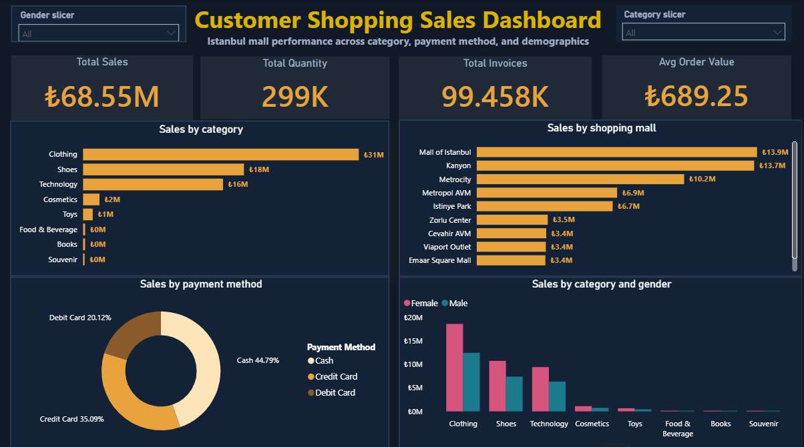

# Customer Shopping Sales Dashboard

## Project Overview

This project is an interactive Power BI dashboard created to analyse customer shopping transactions across different product categories, shopping malls, payment methods and customer demographics.

## Business Objective

The dashboard was created to answer the following questions:

- What is the total sales revenue?
- How many products were sold?
- Which product categories generate the most sales?
- Which shopping malls perform the best?
- Which payment methods are used most frequently?
- How do purchasing patterns differ by gender?

## Dashboard KPIs

- **Total Sales:** 68.55M
- **Total Quantity:** 299K
- **Total Invoices:** 99.458K
- **Average Customer Age:** 43.43 years

## Dashboard Visuals

- Sales by product category
- Sales by shopping mall
- Sales by payment method
- Sales by category and gender
- Gender slicer
- Category slicer

## Key Insights

- Clothing generated the highest sales among all product categories.
- Shoes and Technology were the next strongest categories.
- Mall of Istanbul and Kanyon were the highest-performing shopping malls.
- Cash was the most frequently used payment method.
- Female customers generated more sales than male customers across most categories.

## Tools Used

- Microsoft Power BI
- Power Query
- CSV dataset

## Files

- `customer-shopping-sales-dashboard.pbix` — Power BI dashboard file
- `customer_shopping_data.csv` — original dataset
- `dashboard-preview.png` — dashboard preview image

## Dashboard Features

- Interactive filtering
- KPI cards
- Category-level sales analysis
- Shopping mall performance comparison
- Customer demographic analysis
- Payment method analysis
